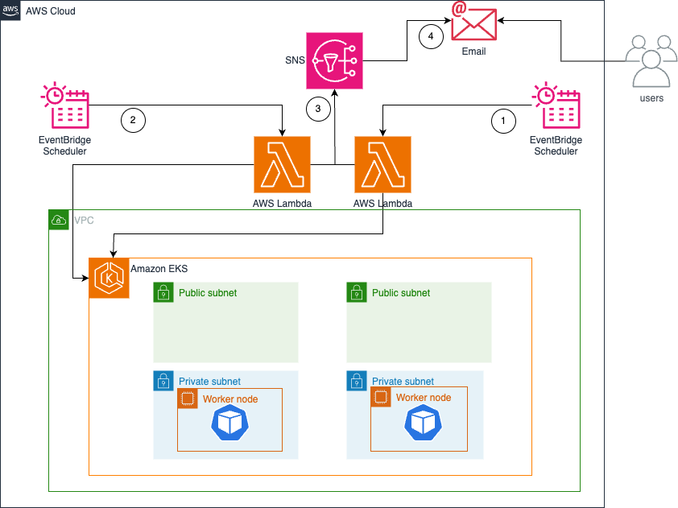

# Automate Kubernetes Version Monitoring for Amazon EKS Clusters

This project provides automated management of Amazon EKS clusters, including:
- **Cluster version monitoring and upgrades**
- **EKS addon version management** (vpc-cni, kube-proxy, coredns, aws-ebs-csi-driver, etc.)
- **Managed node group version updates** with Pod Disruption Budget (PDB) respect

## Features

### 1. Cluster Version Management
- Monitors EKS cluster versions against latest available versions
- Checks upgrade readiness insights before upgrading
- Automatically upgrades development clusters (when enabled)
- Sends email notifications for all cluster status changes

### 2. Addon Management
- Discovers all EKS addons in each cluster
- Checks for available addon updates
- Preserves authentication configuration (Pod Identity, IRSA)
- Updates addons automatically while maintaining compatibility
- Sends consolidated notifications per cluster

### 3. Node Group Management
- Discovers all managed node groups in each cluster
- Compares node group versions with cluster versions
- Updates node groups to match cluster version with latest AMI
- Respects Pod Disruption Budgets (never uses force flag)
- Provides manual force update instructions when PDB blocks updates
- Sends consolidated notifications per cluster

## Architecture



The solution consists of two Lambda functions:

1. **eks-version-checker** (Runs Fridays at 5 PM UTC)
   - Checks cluster versions
   - Manages addon updates
   - Sends notifications

2. **eks-nodegroup-version-manager** (Runs Fridays at 6 PM UTC)
   - Updates node group versions
   - Respects Pod Disruption Budgets
   - Sends notifications

The 1-hour delay ensures addons are updated before node groups are replaced.

## Cluster Filtering

The solution processes only development clusters by checking:
- Cluster tags: `Environment` or `Env` containing "dev" or "development"
- Cluster name: Contains "dev" or "development"

Production clusters are automatically skipped.

## Prerequisites

1. AWS CLI installed and configured
2. An S3 bucket for CloudFormation template upload
3. At least one EKS cluster tagged as development
4. IAM permissions to create CloudFormation stacks, Lambda functions, IAM roles, SNS topics, and EventBridge schedules

## Quick Start

### Option 1: Using the Deployment Script (Recommended)

```bash
# Deploy with default settings (no auto-upgrade)
./deploy.sh YOUR-BUCKET-NAME us-east-1 your-email@example.com false

# Deploy with auto-upgrade enabled
./deploy.sh YOUR-BUCKET-NAME us-east-1 your-email@example.com true
```

### Option 2: Manual Deployment

See [DEPLOYMENT.md](DEPLOYMENT.md) for detailed deployment instructions.

## Configuration

### Parameters

| Parameter | Required | Default | Description |
|-----------|----------|---------|-------------|
| `NotificationEmail` | Yes | - | Email address for SNS notifications |
| `EnableAutoUpgrade` | No | `false` | Enable automatic upgrades for development clusters |

### Tagging Development Clusters

Tag your development clusters with one of:

```yaml
Environment: dev
Environment: development
Env: dev-us-east-1
```

Or include "dev" in the cluster name:
- `my-dev-cluster`
- `development-cluster`

## Notifications

You'll receive consolidated email notifications for:

### Cluster Updates
- Up-to-date clusters
- Available upgrades
- Blocked upgrades (with insights)
- Initiated upgrades

### Addon Updates
- Up-to-date addons
- Successfully updated addons
- Failed addon updates with error details

### Node Group Updates
- Up-to-date node groups
- Updating node groups with update IDs
- Failed updates with PDB guidance

## Troubleshooting

### Template Size Error

If you see "Member must have length less than or equal to 51200":
- The template is 55,594 bytes and exceeds CloudFormation's inline limit
- Solution: Upload to S3 first (see deployment instructions)

### Node Group Updates Failing

If node group updates fail due to Pod Disruption Budgets:
1. Review your PDB configurations
2. Consider temporarily relaxing PDB constraints
3. Use the force flag manually if needed (see notification email for command)

### No Notifications Received

1. Check SNS subscription is confirmed (check your email)
2. Verify Lambda has permission to publish to SNS topic
3. Check CloudWatch logs for errors
4. Ensure clusters are properly tagged as development

## Cost Estimates

Approximate monthly costs:
- Lambda Execution: ~$0.20/month
- CloudWatch Logs: ~$0.50/month
- SNS: ~$0.50/month
- EventBridge Scheduler: Free tier
- **Total: ~$1.20/month**

Actual costs vary based on number of clusters, addons, and node groups.

## Documentation

- [DEPLOYMENT.md](DEPLOYMENT.md) - Detailed deployment guide
- [code.py](code.py) - Addon management Lambda source code
- [nodegroup_code.py](nodegroup_code.py) - Node group management Lambda source code
- [template.yaml](template.yaml) - CloudFormation template

## License

This project is licensed under the MIT License - see the LICENSE file for details.


